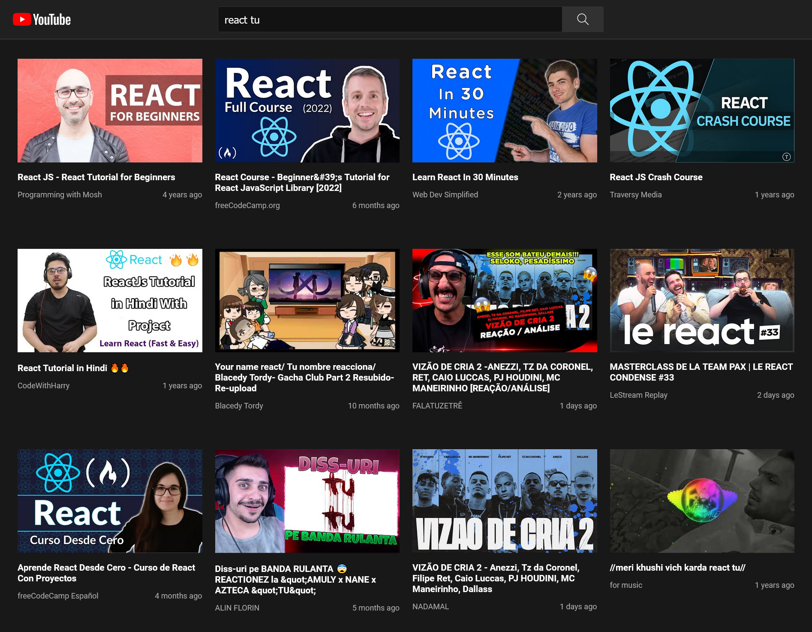

# Youtube Search

## Table of contents

- [Overview](#overview)
  - [The challenge](#the-challenge)
  - [Screenshot](#screenshot)
  - [Links](#links)
- [My process](#my-process)
  - [Built with](#built-with)
- [Author](#author)

## Overview

### The challenge

Users should be able to:

- View the optimal layout for the site depending on their device's screen size
- See the youtube recommendations according to the search content

### Screenshot

### Links

- Solution URL: [https://github.com/HasanliLaman/youtube-search](https://github.com/HasanliLaman/youtube-search)
- Live Site URL: [https://youtube-list.netlify.app/](https://youtube-list.netlify.app/)

## My process

### Built with

- Semantic HTML5 markup
- CSS custom properties
- Grid
- Mobile-first workflow
- Javascript
- React
- [API](https://developers.google.com/youtube/v3)

## Author

- Github - [Laman Hasanli](https://github.com/HasanliLaman)
- Frontend Mentor - [@HasanliLaman](https://www.frontendmentor.io/profile/HasanliLaman)
